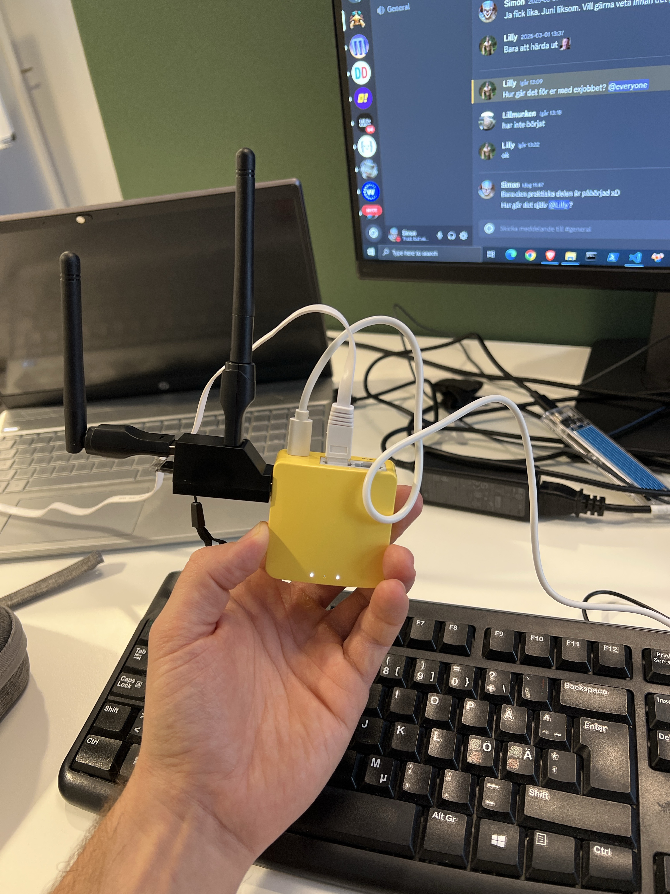

# Wi-Fi Evil Twin & VPN Protection

### Overview
This project was part of my final thesis for a two-year Fullstack .NET Developer vocational program (2023–2025) in Sweden.  
The goal was to explore **security risks in open Wi-Fi networks**, focusing on *Evil Twin* and *Deauthentication* attacks, and to test how **VPN encryption** can protect user data against Man-in-the-Middle exploits.

We built a custom lab using an **OpenWRT-based GL.iNet Mango router** and a **Wi-Fi Pineapple clone** from GitHub to simulate attacks in a controlled environment.

---

### Methodology
All tests were conducted on our own networks and devices in a controlled lab setup.  
The process followed a qualitative, hands-on approach:

1. Configure the GL.iNet Mango (OpenWRT) router with Pineapple clone firmware.  
2. Create a fake open SSID (“SecurityTest”) to simulate an Evil Twin network.  
3. Connect a test client (iPhone) to the fake AP and capture traffic with **tcpdump** and **Wireshark**.  
4. Repeat the same test while connected through **WireGuard VPN**.  
5. Compare packet captures with and without VPN active.

---

### Tools & Equipment
| Category | Tools / Hardware |
|-----------|------------------|
| Router | GL.iNet Mango (OpenWRT) |
| Wi-Fi Adapters | External USB adapters supporting monitor mode & packet injection |
| Software | Pineapple clone (GitHub), Wireshark, tcpdump |
| Client | iPhone (iOS 18) |
| VPN | WireGuard (Integrity VPN) |
| OS | Linux & Windows |

#### Hardware Notes
The Wi-Fi adapters used in this project were chosen specifically for their support of **monitor mode** and **packet injection** - two critical features required to capture and inject wireless frames during testing.  
This capability allowed the Mango router (running the Pineapple clone) to broadcast fake SSIDs and capture client traffic at the packet level.  

The adapters were selected after researching compatibility for **monitor mode** and **packet injection** support. Many common USB adapters are limited to basic client mode only, so I looked for models with proven support in security-testing communities. My main goal was to keep the setup **affordable, open-source–friendly and educational**, while still capable of performing real packet capture and injection in the lab environment.

#### Software Notes
The Pineapple clone (OpenWRT-based) was chosen because it is **free, open-source and easy to obtain**, making it ideal for educational lab work. Using an openly available clone allowed us to inspect and modify the attack surface while keeping the setup reproducible for others.

Key software used:
- **Pineapple clone (OpenWRT)** — for AP emulation and attack modules.  
- **tcpdump** — lightweight packet capture on the Mango device.  
- **Wireshark** — detailed packet analysis and visualisation.  
- **WireGuard** — VPN solution used to validate protection of traffic.

Community projects and guides greatly accelerated setup and troubleshooting; see below for links to resources and repositories used.

Credits: [SHUR1K-N – WiFi MangoApple Resources](https://github.com/SHUR1K-N/WiFi-Mangoapple-Resources)  
and [xchwarze – WiFi Pineapple Cloner](https://github.com/xchwarze/wifi-pineapple-cloner).

---

### Key Findings
- **Evil Twin and Deauthentication attacks are easy to perform** with inexpensive, open-source tools.  
- **Unencrypted traffic (HTTP)** revealed login credentials and session data in plaintext.  
- **VPN encryption (WireGuard)** completely blocked data visibility in Wireshark.  
- **Wi-Fi management frames are unprotected by design**, making networks inherently vulnerable without WPA3 or PMF (802.11w).  
- VPN is the **most effective and accessible defense** for everyday users.

---

### Ethical Considerations
All experiments were carried out **only on our own networks and devices**.  
The purpose was educational - to raise awareness about public Wi-Fi vulnerabilities and promote safer usage, not to perform unauthorized attacks.

---

### Conclusion
Wi-Fi remains convenient but inherently insecure due to unencrypted management frames and user trust in open networks.  
Even simple setups can expose sensitive data - but **VPNs provide a strong, practical layer of protection** that’s easy for anyone to use.

---

### Full Report (Swedish)
The full thesis (in Swedish) includes theoretical background, methodology, results, and recommendations.

[Download full report (PDF)](Examensarbete_Simon_Arnar_Jessie_Martensson.pdf)

---

### References
- OpenWRT Project – https://openwrt.org  
- GL.iNet Mango – https://www.gl-inet.com/products/gl-mt300n-v2/  
- Wireshark – https://www.wireshark.org/  
- WireGuard – https://www.wireguard.com/  
- Hak5 Wi-Fi Pineapple community
- SHUR1K-N – WiFi MangoApple Resources: https://github.com/SHUR1K-N/WiFi-Mangoapple-Resources  
- xchwarze – WiFi Pineapple Cloner: https://github.com/xchwarze/wifi-pineapple-cloner

---

### Authors
**Simon Arnar & Jessie Mårtensson**  
.NET Developer Students (2023–2025)  
🔗 [Portfolio](https://simonarnardev.netlify.app/)  
🔗 [LinkedIn](https://www.linkedin.com/in/simon-arnar/)
